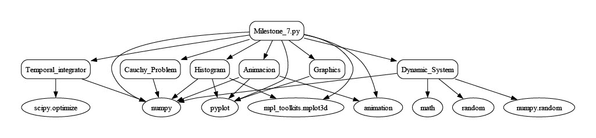

## Ampliación de Matematicas I

# Rubén Garrido

En este GitHub se presentan los códigos y resultados desarrollados en la asignatura Ampliación de Matemáticas de master en sistemas espaciales (MUSE). Contine los códigos principales de los diferntes hitos y las funciones auxiliares que se usan en cada una ellos. Excepto el milestone 1, todos los demás constan de un códgio priniciapal con el nombre del hito correspondiente. Estos "scripts" principales usarán diferentes funciones definidas en los códigos pertenecientes a las carpetas "Funciones_Auxilieres", "Sistemas_dinámicos" y "Animaciones". La carpeta "Funciones_Auxiliares" contienen los scripits necesarios para el funcionamiento de los hitos del 2 al 6. En la carpeta "Sistemas_Dinamicos" se puede encontrar las funciones para la resolución del hito 7. Finalemente, en la carpeta "Animaciones" se encuentran los códigos que realizan todos los gráficos y animaciones de los resultados del hito 7.

A continuación se presenta un esquema de la estructura funcional del hito 7:

